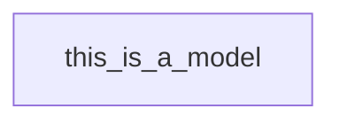
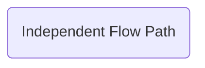
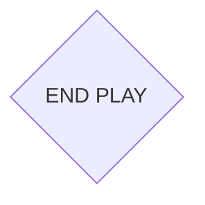
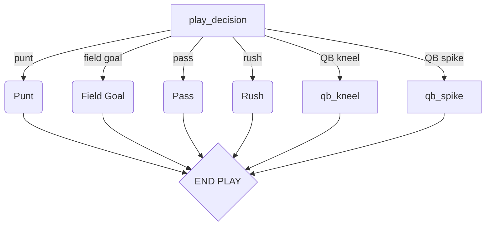
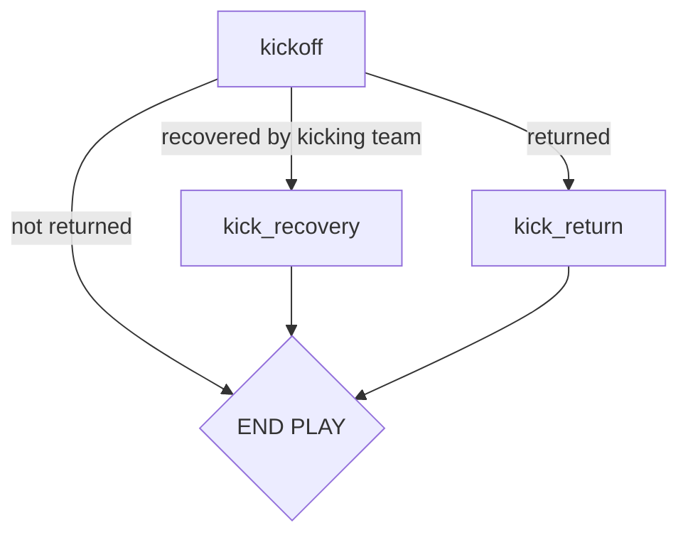
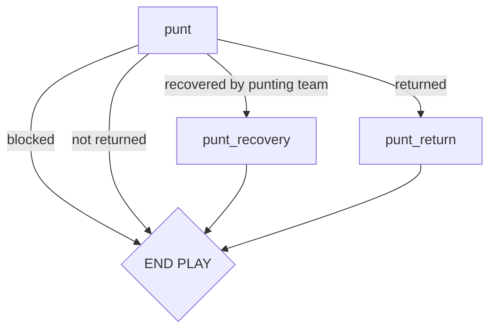
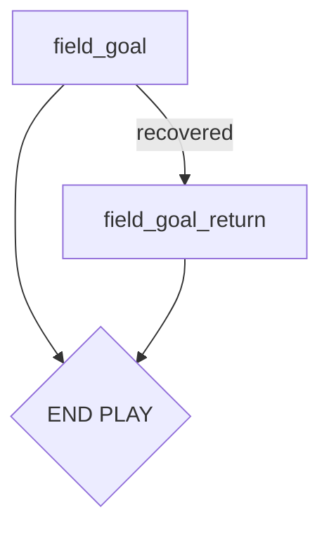
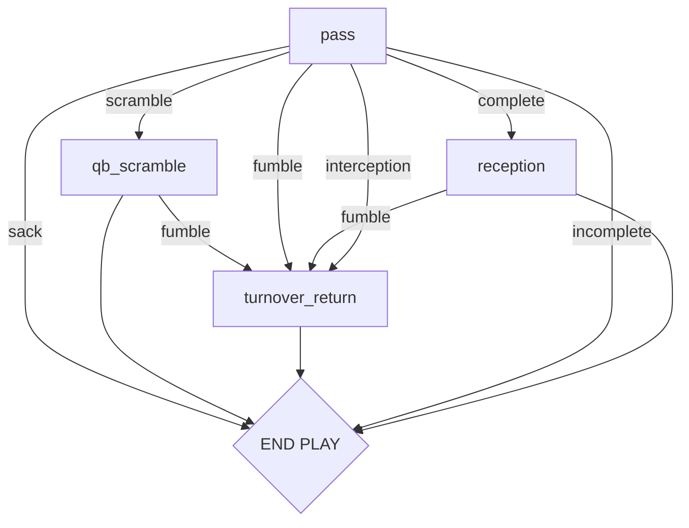
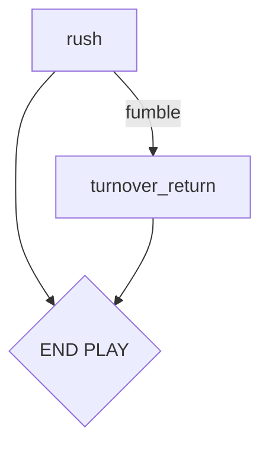

# Contents

- [Contents](#contents)
- [Game Progression](#game-progression)
  - [Play Decision](#play-decision)
  - [Kickoff](#kickoff)
  - [Punt](#punt)
  - [Field Goal](#field-goal)
  - [Pass](#pass)
  - [Rush](#rush)

# Game Progression

Models are stylized in all lowercase with underscores in a square box.

Independent flow paths are stylized with leading capitals and a round box.

The end of play state is stylized in all caps with a diamond box.

## Play Decision

## Kickoff

## Punt

## Field Goal

## Pass

## Rush

